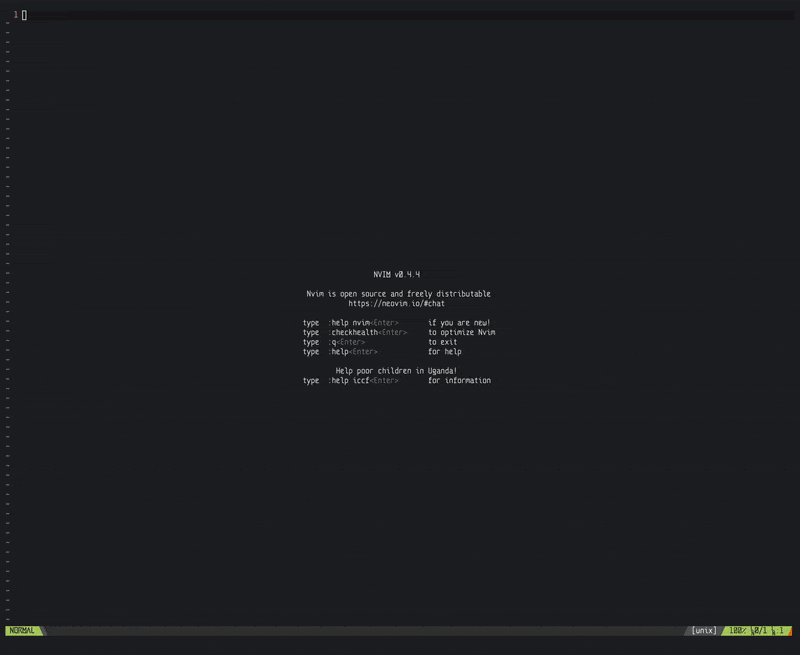

[](https://github.com/benbusby/vim-repoman/actions?query=workflow%3Avint)
[](https://github.com/benbusby/vim-repoman/actions?query=workflow%3Avader)

#### (repo)sitory (man)ager:

Create and manage GitHub issues, pull requests, comments, code reviews, and more using Vim.



## Table of Contents
- [Features](#features)
- [Dependencies](#dependencies)
- [Install](#install)
- [Setup](#setup)
- [Usage](#usage)
- [Configuration](#configuration)
- [Contributing](#contributing)
- [Miscellaneous](#miscellaneous)

## Features
Repoman supports a wide variety of features and GitHub API interactions, including:

- Viewing/creating/editing/closing issues and pull requests
- Commenting on and reacting to issues and pull requests
- Creating and submitting PR reviews
    - Includes multi-line comment and suggestion support, as well as replying to existing review comments
- Quick setup process
- Code block syntax highlighting
- Integration with your Vim theme
- Support for alternative interface languages
    - See [the repoman wiki config page](https://github.com/benbusby/vim-repoman/wiki/Configuration#appearanceui) for details
    - Straightforward process for [contributing new translations](#interface-translations)
- Intuitive keybindings for quickly navigating issues/repos/etc
- And more -- please refer to [the repoman wiki](https://github.com/benbusby/vim-repoman/wiki) for a comprehensive list of features and guides for using the plugin.

## Dependencies
- `vim` >= 8.0 / `neovim`
- `curl`
- `openssl`
  - *Note: For OpenSSL < 1.1.1 or LibreSSL < 2.9.1, `let g:repoman_openssl_old = 1` needs to be included in your `.vimrc`*

## Install
#### Vundle
`Plugin 'benbusby/vim-repoman'`
#### vim-plug
`Plug 'benbusby/vim-repoman'`
#### DIY
  1. Clone the repo to your vim plugin directory
      - Ex: `git clone https://github.com/benbusby/vim-repoman.git ~/.vim/bundle/vim-repoman`
  2. Ensure the plugin's path is included in your Vim runtime path
      - Ex: `:set rtp+=~/.vim/bundle/vim-repoman`

## Setup
1. Create a personal access token
    - GitHub
      - Settings > Developer Settings > Personal Access Tokens
      - Generate new token with the "repo" box checked
    - GitLab (In Progress)
      - Settings > Access Tokens
      - Generate new token with the "api", "read_repository" and "write_repository" boxes checked
2. After installing vim-repoman, run `:RepoManInit`
    - You will be prompted for your token(s) and a password to encrypt them

## Usage

For information and comprehensive guides on how to use the plugin, please refer to [the repoman wiki](https://github.com/benbusby/vim-repoman/wiki)

See also [configuration](https://github.com/benbusby/vim-repoman/wiki/Configuration) and [keybindings](https://github.com/benbusby/vim-repoman/wiki/Keybindings) in the wiki.

For the repoman docs, please refer to `:h repoman`

## Configuration

A full list of the available (optional) global variables for repoman are located [here](https://github.com/benbusby/vim-repoman/wiki/Configuration)

<hr>
  
Example `.vimrc` settings:
```vim
" Defaults
let g:repoman_language = 'en'
let g:repoman_show_outdated = 0
let g:repoman_openssl_old = 0
```

```vim
" French, show outdated, use GitLab by default
let g:repoman_show_outdated = 1
let g:repoman_language = 'fr'
let g:repoman_default_host = 'gitlab'
```

```vim
" Spanish, use older OpenSSL, show footer
let g:repoman_language = 'es'
let g:repoman_openssl_old = 1
let g:repoman_footer = 1
```

## Contributing

Any type of contribution is welcome and appreciated, whether its just using the plugin and validating that the available features work as expected, implementing features or bug fixes, or expanding on the vader tests. 

#### Interface Translations
If you would like to improve the UI translation support, please edit [assets/strings.json](assets/strings.json) accordingly and create a new PR with your changes.

Note that the existing languages have certain sections formatted to align cleanly in the repo and issue list views. Please try to conform to this alignment when adding/editing existing translations.

## Miscellaneous

This plugin is currently in a "beta" release state. If you experience any unexpected behavior, please open an issue.
